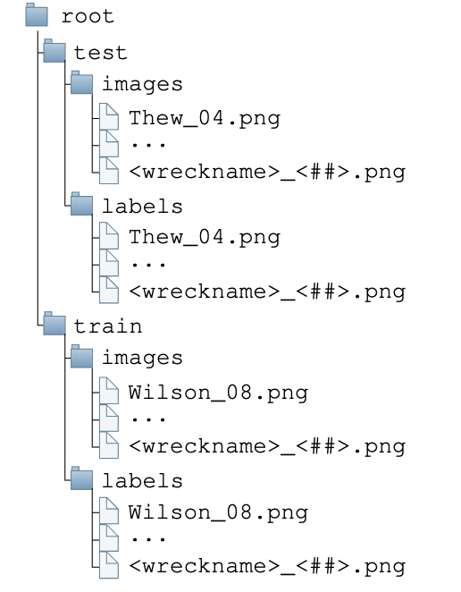

## Dataset Organization
The dataset is organized by the Side-scan Sonar (SSS) images and their corresponding labels.
We provide the labels as segmentation masks of objects belonging to a shipwreck in the SSS image, including the shipwreck itself and any debris associated with the shipwreck.
This includes parts of the shipwreck that may have come off from the shipwreck and parts of the ship that has been dislodged. The images and labels are separated into test and train sets using a 50/50 split.
We select a 50/50 split to ensure that the test set is large enough to capture the variance of the shipwrecks sites, ensuring that the robustness of the dataset can be evaluated through our dataset.
In addition, the images are grouped on a per-site basis.
This is done to ensure that SSS images that see the same terrain, shipwreck, or debris are not shared between the test and train sets of our dataset.

## Dataset File Structure
The dataset file structure is shown in the figure below.

  

## Dataset Helper Scripts
We provide helper scripts to load the dataset and visualize the dataset [here](https://github.com/umfieldrobotics/ai4shipwrecks-scripts).

## Dataset Examples
To be added...

## Download Link
Please check our [download](https://umfieldrobotics.github.io/ai4shipwrecks/download/) page.

