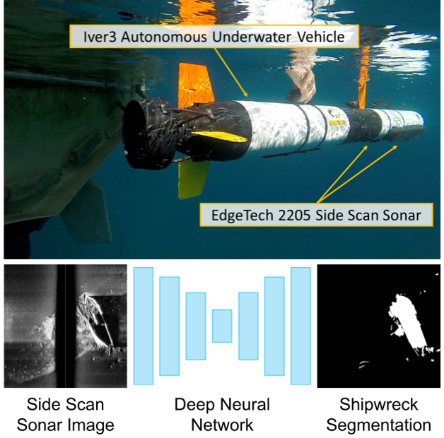
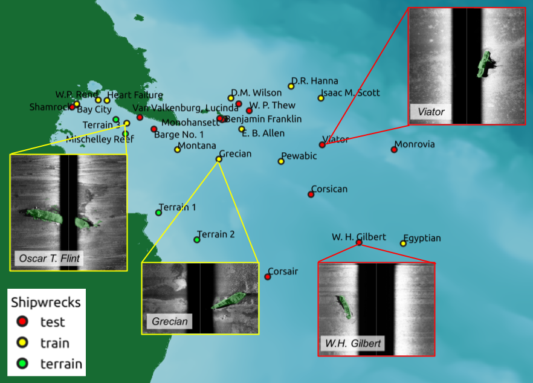
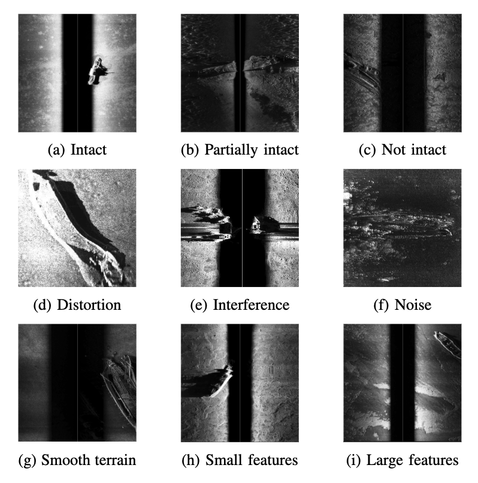

## Dataset Introduction
In this article we present a new dataset (AI4Shipwrecks) and benchmarking results for segmentation of shipwrecks from side scan sonar imagery collected on an AUV. This dataset was collected over the span of 5 weeks in [Thunder Bay National Marine Sanctuary (TBNMS)](https://thunderbay.noaa.gov/) in Lake Huron, Michigan, USA. Spanning 4,300-square-miles, TBNMS contains almost 100 known shipwreck sites and over 100 undiscovered sites. We leverage the unique abundance of known shipwreck sites to curate a rich dataset for investigating the application of machine learning for this task. In this paper, we present details of dataset collection and preparation for easy indexing of our dataset by machine learning pipelines. To encourage further advances in segmentation for side scan sonar, we report extensive results on our dataset from modern, state-of-the-art segmentation models. Lastly, we include discussion on lessons learned from our field expeditions and experiments to provide insight on future challenges and opportunities for machine learning for processing sonar data. The resulting dataset and benchmarking tools will be made publicly available as a benchmark dataset for segmentation from sonar imagery to enable future research in machine learning for ocean exploration.
<!-- add a figure -->

  

## Dataset Release
For the dataset examples please check [here](https://umfieldrobotics.github.io/ai4shipwrecks/examples/). We are preparing to release the dataset and benchmarking tools. Please stay tuned [here](https://umfieldrobotics.github.io/ai4shipwrecks/news/).

## Methodology Overview
### Site Selection
Surveys were conducted in Thunder Bay National Marine Sanctuary (TBNMS) in Lake Huron, MI. 
    The figure below shows shipwreck sites that were imaged in our surveys during four weeks over the course of two years.
    The abundance of known shipwreck targets in TBNMS was a crucial factor in our selection of this field site, as this enabled us to maximize the number of targets observed within a relatively constrained area and short timespan. 
    These proposed survey regions were selected in coordination with scientists at TBNMS to cover a wide range of ship types, site relief, wreck characteristics, and water depth, prioritizing sites within a reasonable distance from the port of Alpena. 
    This ensured that we could survey a maximum number of sites while still capturing variation across samples, providing a unique and valuable dataset for training machine learning methods. 
    Furthermore, this large and diverse dataset allows us to validate and thoroughly evaluate the accuracy and generalizability of developed methods.

  

### Side-scan Sonar
A side-scan sonar (SSS) emits fan-shaped low and high-frequency acoustic pulses from two transducers aimed at the seabed floor. The signal travels through the water column and reflects off the terrain or other objects in the swath area before being received by the sensor. After a sonar chirp has been emitted, the sensor receives and bins the intensity of returns according to time-of-flight. On the horizontal axis, an SSS image is a histogram of return intensity at equally spaced intervals in time. Each histogram is accumulated in the vertical axis as the transducer moves to produce an image with two dimensions. The higher the echo signal intensity, the higher the pixel value in the resulting sonar image. Raw SSS imagery is single channel grayscale but can be viewed with various color palettes for improved visibility.

Although side scan sonar produces high resolution images of the environment, view-dependent shadowing effects, self-occlusion, material-dependent acoustic noise, and distortion make object detection a difficult task for both humans and automated algorithms. The figure below illustrates common distortions and noise found in side scan sonar imagery.

  

### Strided Cropping
As survey lengths can vary for each mission, the resulting sonar images are of different lengths. the dataset provides full-sized images, but we square-cropped these images to be input to deep neural networks. Crops are generated. Please check our paper for more details.

## Labeling Policy
Pixel-wise labeling of the post-processed sonar images was conducted by a team of three researchers with shared labeling guidelines.
The labels were then reviewed in-depth by a marine archaeologist from the State of Michigan who is an expert on the shipwrecks at TBNMS. 
There are two labels: `shipwreck` and `other`. 
`shipwreck` consists of the primary wrecks as well as any debris.
If part of the ship is obscured in an acoustic shadow, the label was extrapolated into the shadowed region to follow the expected shape of the wreck based off of expert knowledge.
The labels are exported to a standard binary mask format where 0 represents the `other` class and 1 represents the `shipwreck` class.
